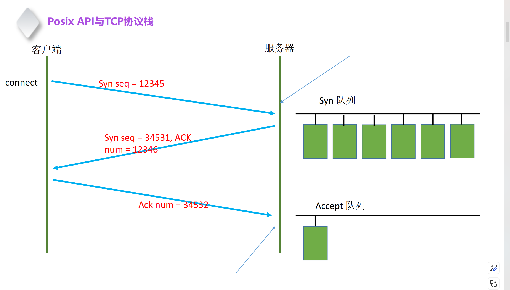
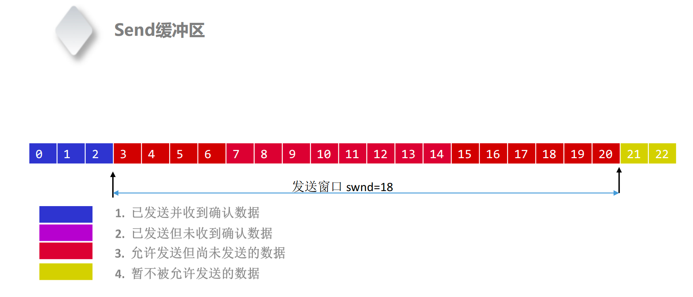
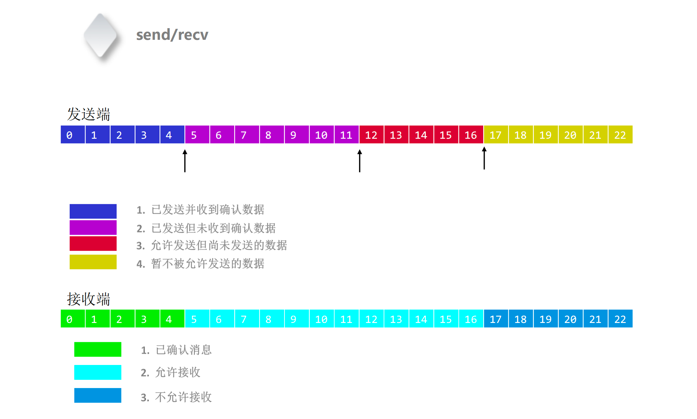
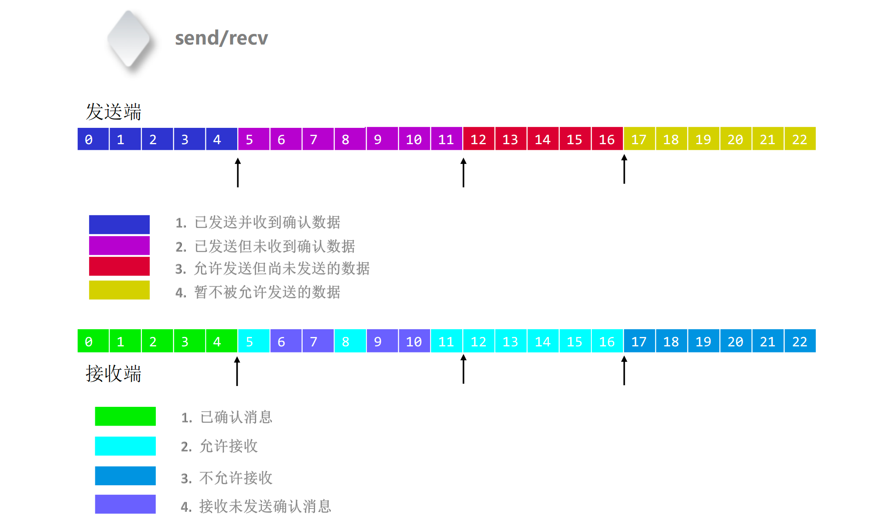
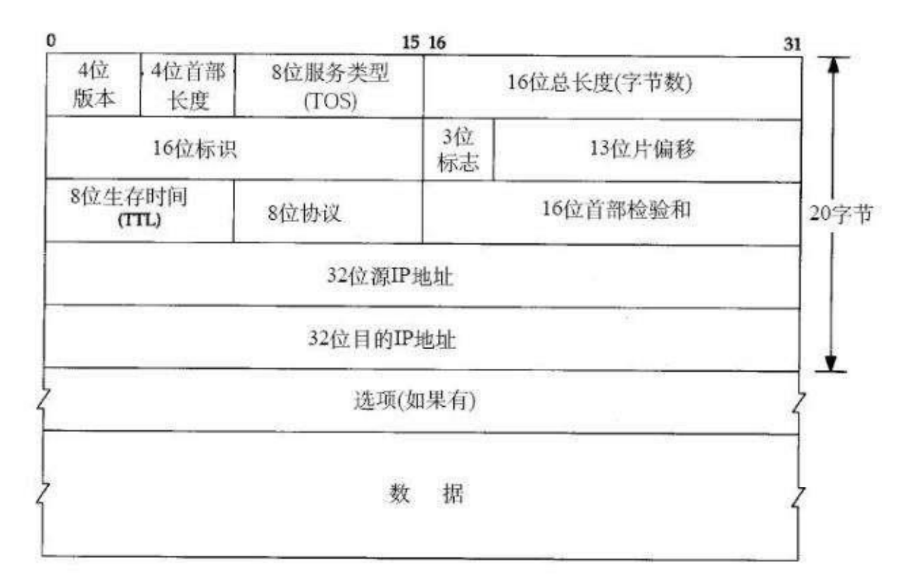
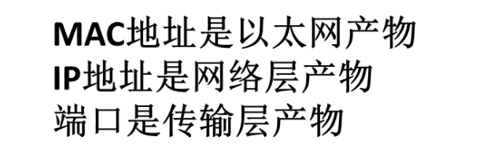
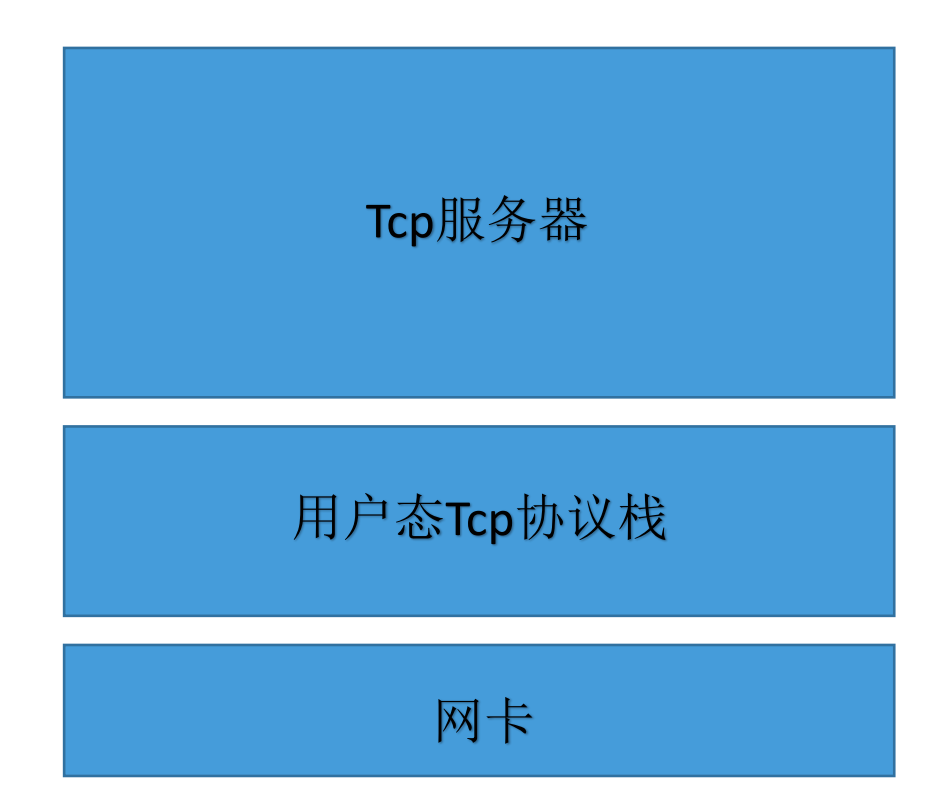
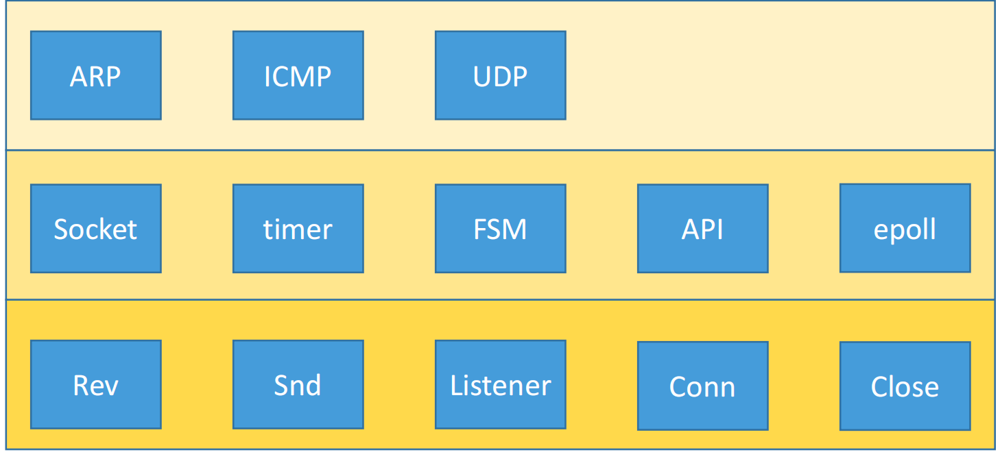

C /C++  知识

[socket ,websocket,http关系详解](https://blog.csdn.net/qq_23232637/article/details/143312256?spm=1001.2014.3001.5501)

[Ubuntu16.0版本-22.14版本服务器搭建](https://blog.csdn.net/qq_23232637/article/details/143312234?spm=1001.2014.3001.5501)

 [Linux  fd 和file 详解](https://blog.csdn.net/qq_23232637/article/details/143312142?spm=1001.2014.3001.5501)

[TCP tcb 控制块 和fd文件描述符](https://blog.csdn.net/qq_23232637/article/details/143312186?spm=1001.2014.3001.5501) 

[Linux中的fd 和file](https://blog.csdn.net/qq_23232637/article/details/143312142?spm=1001.2014.3001.5501)

[大端小端问题  ](https://blog.csdn.net/qq_23232637/article/details/136120999?spm=1001.2014.3001.5501)

[IO多路复用的理解 ](https://blog.csdn.net/qq_23232637/article/details/135912540?spm=1001.2014.3001.5501)

Posix API与网络协议栈的实现原理-V1

1. TCP三次握手过程？
2. TCP四次挥手过程？
3. 为什么建立连接需要三次握手，而断开连接需要四次握手？
4. TIME_WAIT状态持续时间及原因
5. 超时重传和快速重传
6. TCP首部长度，有哪些字段
7. TCP在listen时的参数backlog的意义
8. Accept发生在三次握手的哪一步？
9. 三次握手过程中有哪些不安全性
   10.TCP与UDP的区别

   

